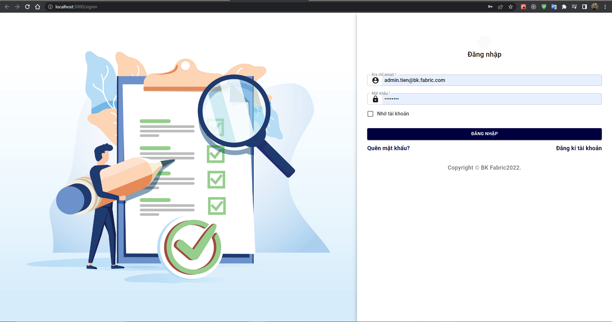

# Luận văn tốt nghiệp

## Đề tài:

# QUẢN LÝ ĐƠN ĐẶT HÀNG CHO DOANH NGHIỆP VẢI TRÊN MOBILE

Đề tài hiện thực trên nền tảng mobile và website. Ở nền tảng website, nhóm sử dụng thư viện ReactJS để hiện thực giao diện và các chức năng cho Nhân viên quản lý.

## Giới thiệu về cấu trúc tổ chức thư mục của dự án:

- public: Chứa tất cả các tài nguyên tĩnh sử dụng cho dự án.
- src:
  - api: Dùng để chứa các file để gọi các api tới server.
  - components: Chứa các component dùng cho dự án.
  - mock: Tại ra các mock api.
  - page: Hiện thực các trang giao diện.
  - screen: Hiện thực trang giao diện kết hợp thanh sidebar.
  - theme: Chứa các file cấu hình css cho giao diện.
  - utils: Chứa các function phục vụ cho các component.
- routes.js: Cấu hình route url của dự án.
- env.development: Chứa endpoint của api server.
- package.json: Chứa các dependence của các thư viện được sử dụng trong dự án.

## Các bước để chạy dự án

1. Clone dự án về bằng lệnh `git clone https://github.com/VanTien266/dclv.git`
2. Truy cập vào thư mục chứa dự án, chạy lệnh `npm i hoặc npm install` để tải các thư viện cần thiết.
3. Chạy lệnh `npm start` để chạy dự án lên [http://localhost:3000](http://localhost:3000) trên cửa sổ trình duyệt.
4. Màn hình login sẽ được hiển thị như bên dưới:
   
   Sử dụng tên đăng nhập `admin.tien@bk.fabric.com` và mật khẩu `Tien@123` để đăng nhập vào ứng dụng.
